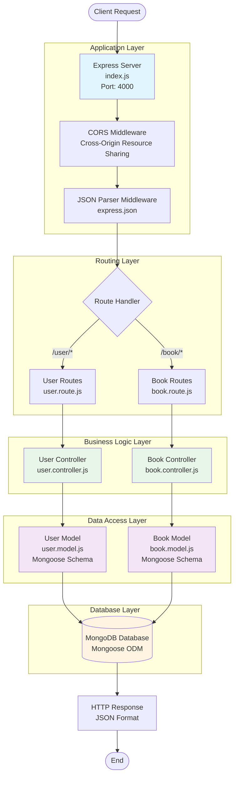
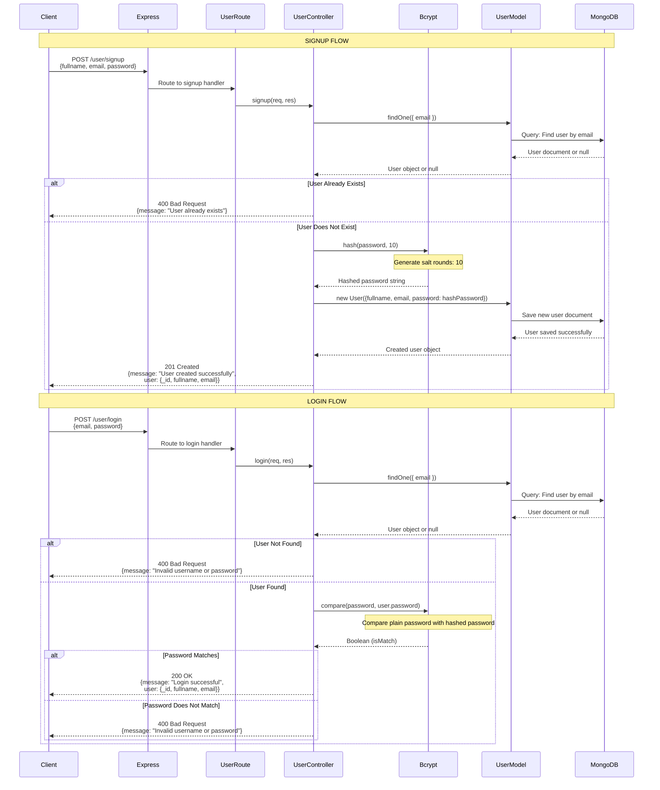
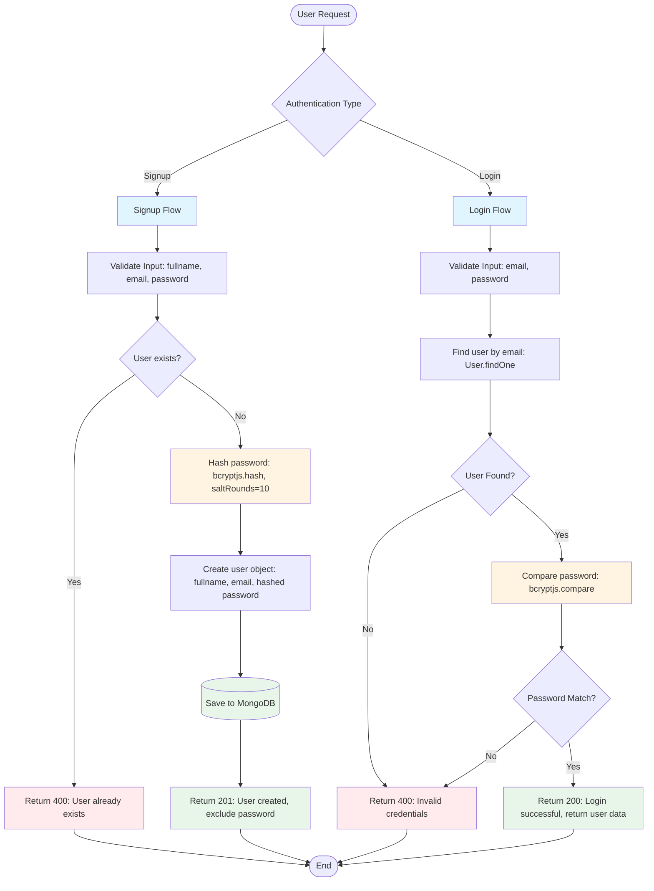
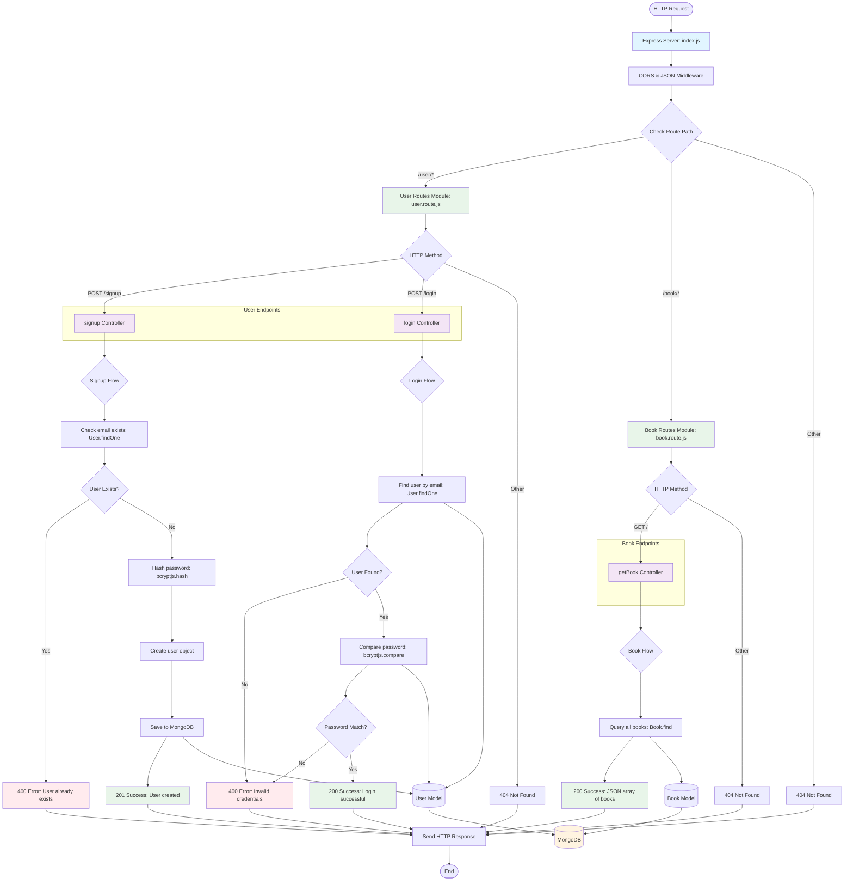
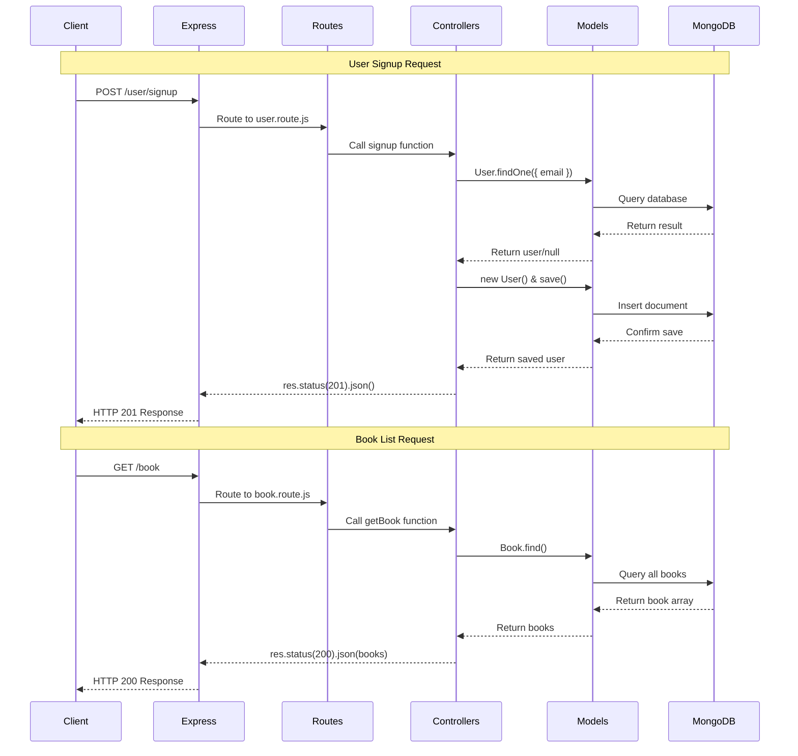
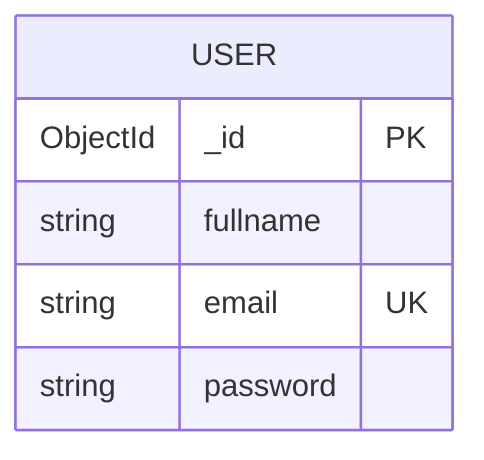
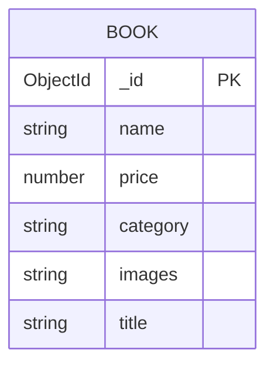

# Backend Architecture Flowcharts

This document contains flowcharts for the Backend Architecture, Authentication & Authorization, and Routes flow.

---

## 1. Backend Architecture Overview

---

## 2. Authentication and Authorization Architecture

### 2.1 Unified Authentication Flow (Signup & Login)

### 2.2 Authentication Flow Diagram

---

## 3. Routes Flowchart

### 3.1 Unified Routes Flow (Structure & Detailed Flow)

### 3.2 Request-Response Flow

---

## 4. Database Schema

### 4.1 User Model Schema

### 4.2 Book Model Schema

---

## Summary

### Backend Architecture Components:
- **Server**: Express.js server with CORS and JSON middleware
- **Routes**: Modular route handlers for `/user` and `/book`
- **Controllers**: Business logic handlers (signup, login, getBook)
- **Models**: Mongoose schemas for User and Book
- **Database**: MongoDB for data persistence

### Authentication Flow:
- **Signup**: Email validation → Password hashing (bcryptjs, 10 rounds) → User creation
- **Login**: Email lookup → Password comparison (bcryptjs.compare) → User data return
- **Security**: Uses bcryptjs for password hashing with salt rounds

### Available Routes:
- `POST /user/signup` - Create new user account
- `POST /user/login` - Authenticate user
- `GET /book` - Retrieve all books

### Technology Stack:
- **Runtime**: Node.js with ES Modules
- **Framework**: Express.js
- **Database**: MongoDB
- **ODM**: Mongoose
- **Security**: bcryptjs for password hashing
- **Middleware**: CORS, JSON parser

---

*Generated for Student Management API - Backend*
