# Frontend Architecture Flowcharts

This document contains flowcharts for the Frontend Architecture, Component Structure, Routing, Authentication Flow, and State Management.

---

## 1. Frontend Architecture Overview

---

## 2. Component Architecture

### 2.1 Component Hierarchy

### 2.2 Component Communication Flow

---

## 3. Routing Flow

### 3.1 Route Structure

### 3.2 Route Protection Flow

---

## 4. Authentication Flow

### 4.1 Signup Flow

### 4.2 Login Flow

### 4.3 Authentication State Management

---

## 5. State Management Flow

### 5.1 Context API Flow

### 5.2 State Update Flow

---

## 6. API Integration Flow

### 6.1 API Request Flow

```mermaid
flowchart LR
    Component[React Component] --> FormValidation[Form Validation<br/>react-hook-form]
    
    FormValidation -->|Valid| PrepareData[Prepare Request Data<br/>userInfo object]
    FormValidation -->|Invalid| ShowErrors[Show Validation Errors]
    
    PrepareData --> AxiosCall[Axios POST Request<br/>http://localhost:4001]
    
    AxiosCall --> Backend[(Backend API)]
    
    Backend --> Response{Response Status}
    
    Response -->|200/201| Success[Success Handler]
    Response -->|400/500| Error[Error Handler]
    
    Success --> UpdateState[Update Auth State<br/>setAuthUser]
    Success --> UpdateStorage[Update localStorage<br/>setItem Users]
    Success --> ShowToast[Show Success Toast<br/>react-hot-toast]
    Success --> Navigate[Navigate/Reload]
    
    Error --> ShowErrorToast[Show Error Toast<br/>Display error message]
    
    UpdateState --> ReRender[Re-render UI]
    UpdateStorage --> ReRender
    ShowToast --> End([End])
    ShowErrorToast --> End
    Navigate --> End
    
    style Component fill:#e1f5ff
    style Backend fill:#fff4e1
    style Success fill:#e8f5e9
    style Error fill:#ffebee
```

### 6.2 API Endpoints Used

---

## 7. User Interaction Flow

### 7.1 Complete User Journey

---

## Summary

### Frontend Architecture Components:
- **Framework**: React 18 with Vite
- **Routing**: React Router DOM v6
- **State Management**: Context API (AuthProvider)
- **Form Handling**: React Hook Form
- **HTTP Client**: Axios
- **UI Library**: Tailwind CSS + DaisyUI
- **Notifications**: React Hot Toast
- **Storage**: localStorage for persistence

### Key Features:
- **Authentication**: Signup and Login flows with state management
- **Route Protection**: Protected routes with authentication check
- **State Persistence**: User data stored in localStorage
- **Form Validation**: Client-side validation with react-hook-form
- **Error Handling**: Toast notifications for success/error states
- **Theme Support**: Dark/Light mode toggle

### Component Structure:
- **Pages**: Home, Signup, Courses
- **Layout Components**: Navbar, Footer
- **Feature Components**: Banner, Freebook, Course
- **Auth Components**: Login, Signup, Logout

### API Integration:
- `POST /user/signup` - User registration
- `POST /user/login` - User authentication
- `GET /book` - Fetch books/courses

### Technology Stack:
- **Build Tool**: Vite
- **Language**: JavaScript (ES Modules)
- **Styling**: Tailwind CSS, DaisyUI
- **Icons**: SVG icons
- **Carousel**: React Slick

---

*Generated for Student Management API - Frontend*
